# Groups Management System - Architecture Overview

This document provides a high-level overview of the Groups Management System architecture and component relationships.

## System Architecture Diagram


## Group Hierarchy Structure

```plantuml
@startuml
title Group Hierarchy Structure

package "Root Group (/)" {
    note top : System root\nSuper Admin access

    package "Parent Company (/Reliance)" {
        note top : Parent Company\nAccount ID: ACC-123
        
        package "Subsidiary 1 (/Reliance/Jio)" {
            note top : Telecom Division
            
            package "Sub-division (/Reliance/Jio/JioFiber)" {
                note top : Fiber Services
            }
            
            package "Sub-division (/Reliance/Jio/JioMobile)" {
                note top : Mobile Services
            }
        }
        
        package "Subsidiary 2 (/Reliance/Retail)" {
            note top : Retail Division
            
            package "Sub-division (/Reliance/Retail/Fashion)" {
                note top : Fashion Retail
            }
            
            package "Sub-division (/Reliance/Retail/Grocery)" {
                note top : Grocery Retail
            }
        }
        
        package "Subsidiary 3 (/Reliance/Energy)" {
            note top : Energy Division
        }
    }
    
    package "Another Company (/TCS)" {
        note top : IT Services Company
        
        package "Division (/TCS/Consulting)" {
            note top : Consulting Services
        }
        
        package "Division (/TCS/Development)" {
            note top : Software Development
        }
    }
}

@enduml
```

## User-Group-Role Relationships


## Security Context Flow

```plantuml
@startuml
title Security Context Flow

participant "Client" as Client
participant "API Gateway" as Gateway
participant "AuthZ Service" as AuthZ
participant "JWT Service" as JWT
participant "Group Permissions" as GroupPerms
participant "Business Service" as Service

Client -> Gateway: Request with JWT Token\nX-Group-Context: /Reliance/Jio
Gateway -> JWT: Validate Token
JWT --> Gateway: Token Claims\n{email, groups: ["Reliance|||admin", "Reliance/Jio|||admin"]}

Gateway -> AuthZ: Extract Security Context
AuthZ -> AuthZ: Parse Groups from Token\n{"/Reliance": "ADMIN", "/Reliance/Jio": "ADMIN"}
AuthZ -> AuthZ: Validate Group Context\n- /Reliance/Jio is child of user's groups ✓
AuthZ -> AuthZ: Create Security Context\n{email, groupId: "/Reliance/Jio", groupRoles: {...}}

Gateway -> Service: Business Operation\nwith Security Context
Service -> GroupPerms: Check Authorization\nisAuthorized(sourceGroups, callerPermissions, requiredRoles, mode)
GroupPerms -> GroupPerms: Hierarchical Permission Check
GroupPerms --> Service: Authorization Result
Service --> Gateway: Operation Result
Gateway --> Client: Response

@enduml
```



## Key Components Description

### API Gateway Layer
- **API Gateway**: Central entry point for all requests
- **Load Balancer**: Distributes traffic across service instances

### Authentication & Authorization
- **JWT Token Service**: Validates and parses JWT tokens
- **AuthZ Service**: Handles authorization logic and security context
- **Cognito**: External identity provider for user authentication
- **Group Permissions**: Fine-grained access control based on group hierarchy

### Business Logic Layer
- **Group Service**: Manages group CRUD operations and hierarchy
- **User Service**: Handles user management and group membership
- **Security Utils**: Utility functions for role-based access control

### Data Access Layer
- **Group Repository**: Data access layer for group operations
- **User Repository**: Data access layer for user operations

### Data Storage
- **MongoDB**: Document database storing groups and users
- **Groups Collection**: Stores group hierarchy and metadata
- **Users Collection**: Stores user profiles and group memberships

## Security Principles

1. **Hierarchical Access Control**
   - Parent group admins can access child groups
   - Child group admins cannot access parent groups
   - Sibling groups have no cross-access

2. **Role-Based Permissions**
   - ADMIN: Full CRUD operations
   - CONTRIBUTOR: Read and limited write operations
   - READER: Read-only access

3. **Context Validation**
   - Group context must be within user's assigned groups
   - Operations are scoped to the current group context

4. **Audit and Compliance**
   - All operations are logged with user context
   - Immutable audit trail for compliance

## Scalability Considerations

- **Horizontal Scaling**: Services can be scaled independently
- **Caching**: Group hierarchy and permissions can be cached
- **Database Sharding**: Groups can be sharded by organization
- **Event-Driven Architecture**: Async processing for non-critical operations 