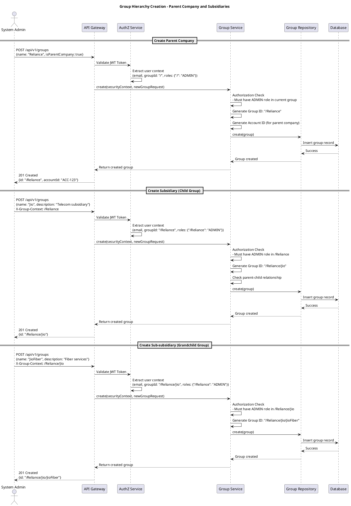
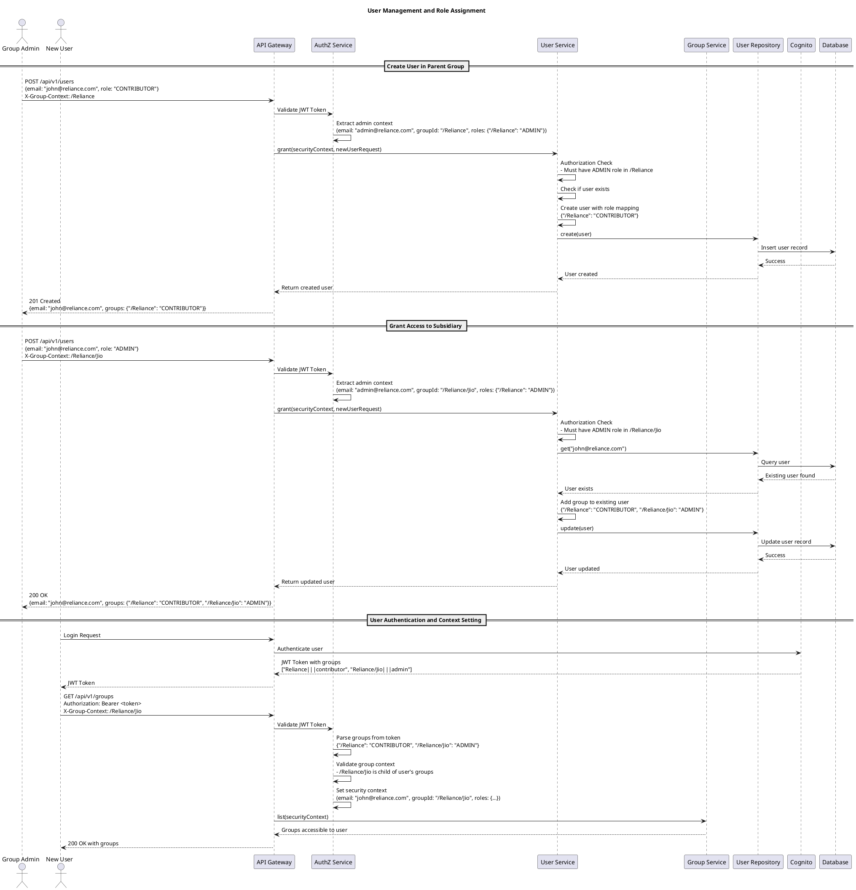
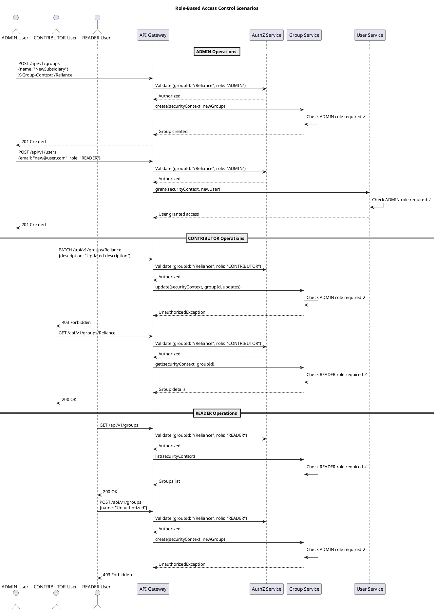
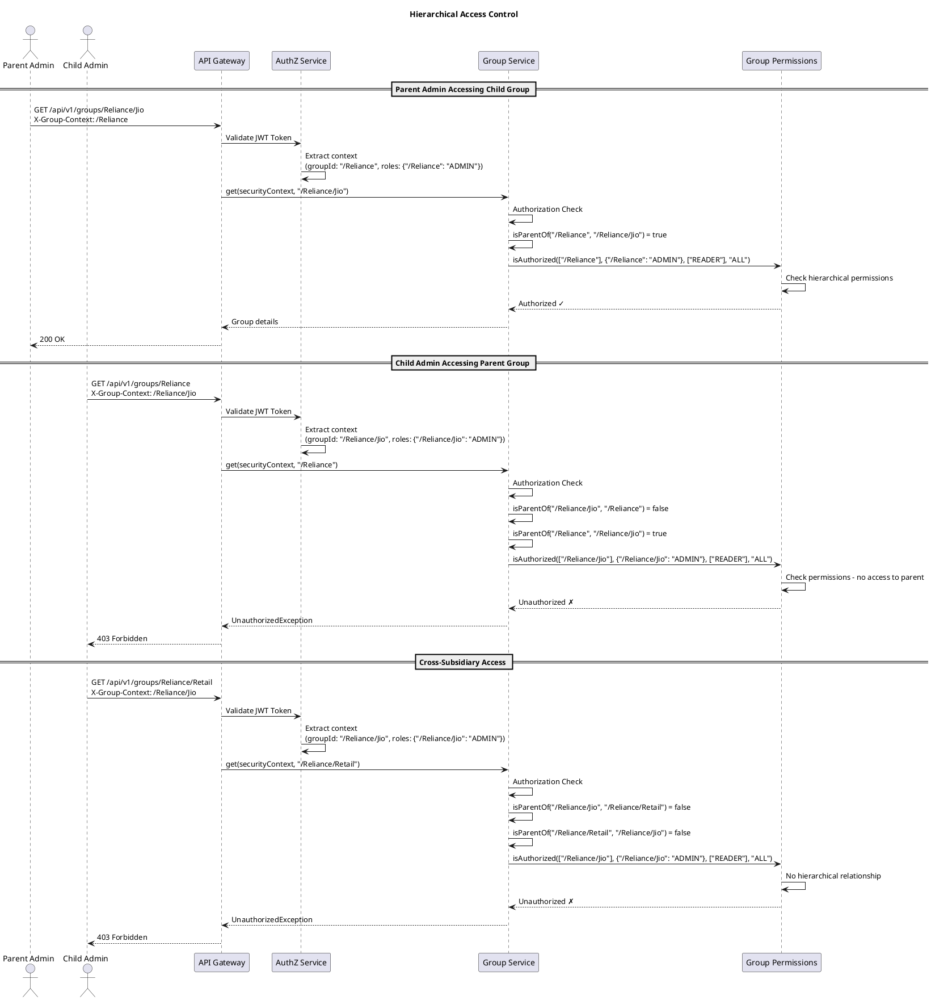
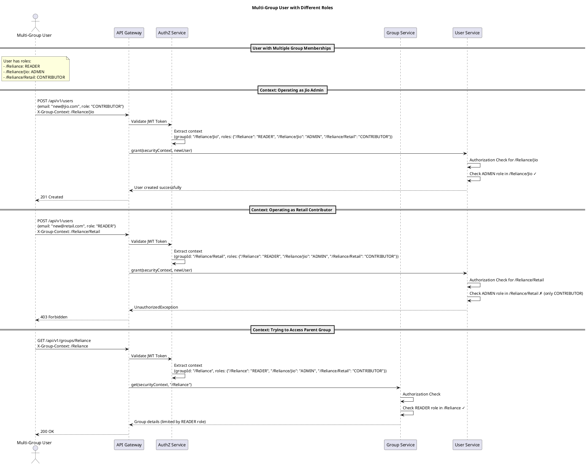
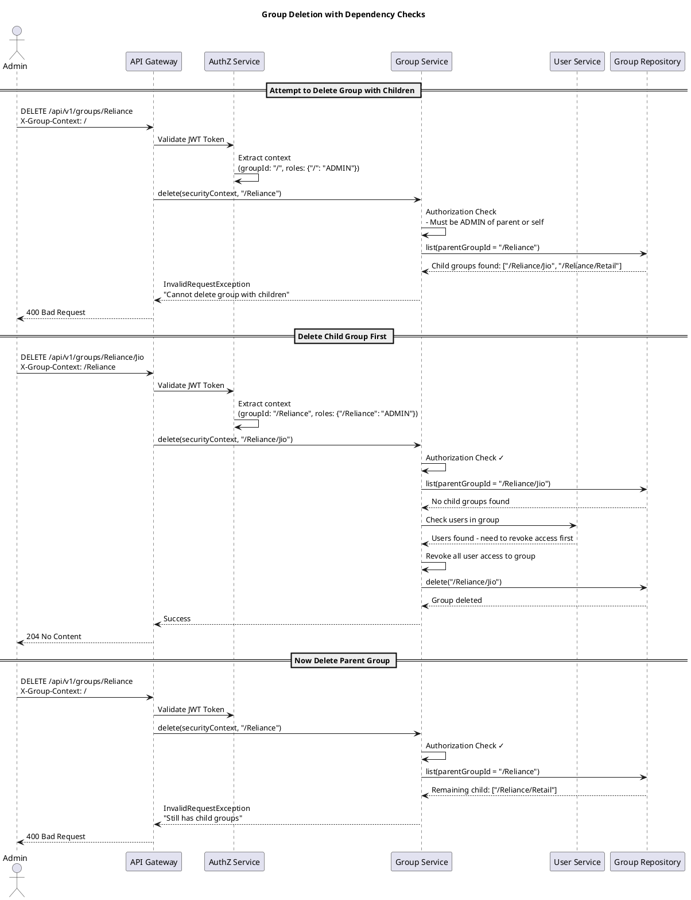

# Groups Management Sequence Diagrams

This document provides comprehensive sequence diagrams for the Groups Management System, covering different use cases including parent groups, child groups (subgroups), user creation, and roles application.

## Table of Contents

1. [System Overview](#system-overview)
2. [Group Hierarchy Creation](#group-hierarchy-creation)
3. [User Management and Role Assignment](#user-management-and-role-assignment)
4. [Group Access Control](#group-access-control)
5. [Complex Scenarios](#complex-scenarios)

## System Overview

The system supports hierarchical group structures with the following key components:
- **Groups**: Hierarchical structure with parent-child relationships
- **Users**: Can belong to multiple groups with different roles
- **Roles**: ADMIN, CONTRIBUTOR, READER (hierarchical permissions)
- **Security Context**: Authorization based on group membership and roles

### Role Hierarchy
- **ADMIN**: Full access (create, read, update, delete)
- **CONTRIBUTOR**: Read and write access
- **READER**: Read-only access

## Group Hierarchy Creation

### Use Case 1: Creating Parent Company and Subsidiaries

## User Management and Role Assignment

### Use Case 2: User Creation and Role Assignment Across Groups

### Use Case 3: Role-Based Access Control in Action

## Group Access Control

### Use Case 4: Hierarchical Access Control

## Complex Scenarios

### Use Case 5: Multi-Group User with Different Roles

### Use Case 6: Group Deletion with Dependency Checks

## Key Security Principles

1. **Hierarchical Authorization**: Parent group admins can access child groups, but not vice versa
2. **Role-Based Access Control**: Operations require specific minimum roles
3. **Context Validation**: Group context must be a child of user's assigned groups
4. **Dependency Management**: Groups with children or users cannot be deleted without cleanup
5. **Audit Trail**: All operations are logged with user context and timestamps

## Role Requirements Summary

| Operation | Required Role | Scope |
|-----------|---------------|-------|
| Create Group | ADMIN | Current group context |
| Update Group | ADMIN | Target group or its parent |
| Delete Group | ADMIN | Target group or its parent |
| List Groups | READER | Current group context |
| Get Group | READER | Target group or hierarchically related |
| Grant User Access | ADMIN | Current group context |
| Revoke User Access | ADMIN | Current group context |
| Update User | ADMIN (for state changes) | All user's groups |
| List Users | READER | Current group context | 